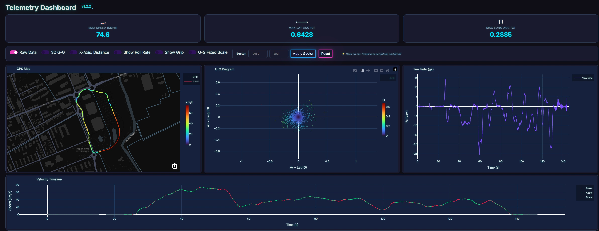
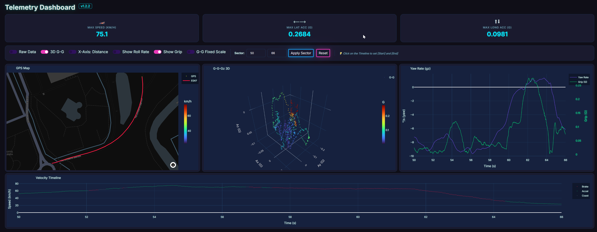
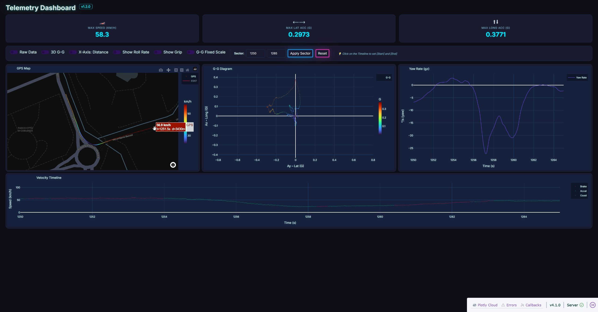
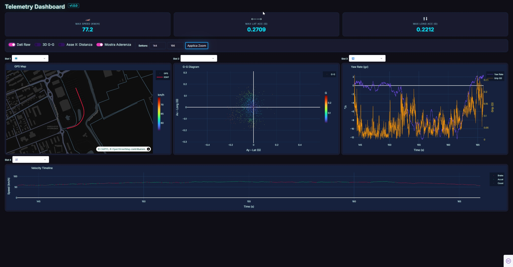
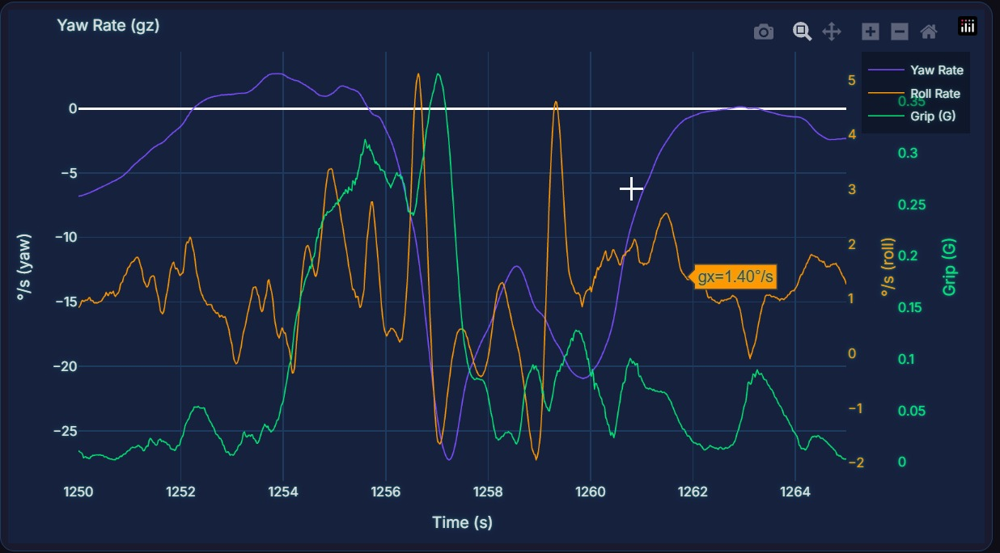
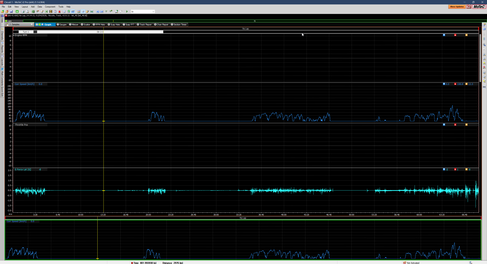
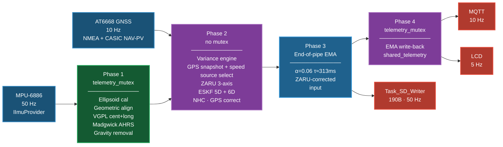

# esp32-motorsport-telemetry-rtos-eskf
Dual-core FreeRTOS telemetry firmware for ESP32-S3 with 50Hz ESKF sensor fusion and MoTeC i2 Pro integration.

# ESP32 Telemetria


> Motorsport telemetry system for the **M5Stack Atom S3** (ESP32-S3).
> 50 Hz IMU · GPS fusion · Error-State Kalman Filter · SD logging · MoTeC i2 Pro export



---

## Overview

ESP32 Telemetria is a self-contained data-acquisition unit that fits in your hand and logs professional-grade telemetry at 50 Hz. It fuses a 6-DOF IMU (MPU-6886) with GPS to estimate position, velocity, and heading through an Error-State Kalman Filter running in real time on the Atom S3's dual-core ESP32-S3.

Recorded sessions are stored in a compact binary format on a micro-SD card and can be post-processed through a Python toolchain that outputs interactive dashboards or native **MoTeC i2 Pro** log files — the same format used by professional motorsport engineers.

As of v1.5.0 the IMU and GPS stacks are abstracted behind `IImuProvider` / `IGpsProvider` interfaces, decoupling the pipeline from hardware. Every session logs sensor-frame raw IMU plus explicit GPS timing metadata and, when available, CASIC `NAV-PV` velocity fields (`nav_speed2d`, `nav_s_acc`, `nav_vel_n/e`, `gps_speed_source`). This enables offline SITL replay of the same GPS speed-source selection logic used by the firmware.

**Current firmware:** v1.5.0

---

## Hardware

| Component | Part | Interface |
|-----------|------|-----------|
| Main board | [M5Stack Atom S3](https://shop.m5stack.com/products/atoms3-dev-kit) | — |
| IMU | MPU-6886 (built-in) | I2C |
| GPS | ATGM336H-6N | UART1 (pins 1/2), 115200 baud |
| Storage | Micro-SD | SPI (pins 5–8) |
| Display | Built-in LCD | M5Unified |

## Bill of Materials

The entire project is designed to be affordable, modular, and extremely compact. You can build the full telemetry stack for **under $30**.

| Component | Role | Price (Est.) | Link |
|:----------|:-----|:-------------|:-----|
| **ATOMS3 Dev Kit** (0.85" screen) | Core MCU (ESP32-S3 dual-core), MPU-6886 IMU, built-in LCD | ~$15.50 | [M5Stack Store](https://shop.m5stack.com/products/atoms3-dev-kit-w-0-85-inch-screen?variant=43676991258881) |
| **GPS/BDS Unit v1.1** (AT6668) | 10 Hz position and speed data for ESKF sequential correction | ~$9.95 | [M5Stack Store](https://shop.m5stack.com/products/gps-bds-unit-v1-1-at6668) |
| **ATOMIC TF-Card Reader** | SPI interface for 50 Hz async binary data logging | ~$4.50 | [M5Stack Store](https://shop.m5stack.com/products/atomic-tf-card-reader) |
| **Total** | | **~$29.95** | |

> A standard Micro SD card (FAT32, ≤ 16 GB, Class 10 or faster) is also required.

---

## Features

- **50 Hz IMU pipeline** — 5-phase signal chain: ellipsoid calibration → geometric alignment → VGPL-compensated Madgwick AHRS → gravity removal → ESKF navigation → end-of-pipe EMA
- **Ellipsoid hard/soft-iron calibration** for the accelerometer (tumble-test derived, `W·(a−B)` applied pre-rotation)
- **VGPL kinematic compensation** (v1.4.1) — subtracts both centripetal (`v×ωz/g`) and longitudinal (`dv/dt/g`) acceleration before Madgwick, keeping beta > 0 at all times and eliminating horizon tilt from gyro drift
- **ZARU-to-Madgwick bias correction** — thermal bias learned by ZARU is fed back into the gyro before Madgwick each cycle, preventing ~4.7 °/s/hr electronic drift from projecting phantom acceleration into the navigation output
- **3-axis ZARU** (static + straight-line) — statistical gyro bias estimator on a 50-sample variance window; straight-line mode uses a triple gate (lateral-G · yaw rate · COG variation over 15 m baseline)
- **Error-State Kalman Filter (ESKF2D)** — 5-state `[px, py, vx, vy, θ]` fused with GPS at ~10 Hz; sequential 3-stage correction (position → speed → COG); Mahalanobis innovation gate
- **Non-Holonomic Constraint (NHC)** — `v_lateral = 0` pseudo-measurement continuously corrects heading drift while in motion (> 5 km/h, disabled above 0.5 g lateral)
- **Shadow ESKF_6D** — 6-state filter with independent online gyro-bias estimation, running in parallel for validation; logged as `kf6_*`
- **GPS staleness detection** via monotonic IMU clock (`timestamp_us − fix_us > 5 s`), same timebase as IMU for deterministic SITL replay
- **CASIC NAV-PV binary velocity channel** (v1.5.0) — parses explicit ground speed, speed accuracy estimate, ENU velocity components and validity flags alongside legacy NMEA SOG; firmware prefers NAV-PV when fresh and falls back to NMEA automatically
- **Dependency-injection IMU/GPS providers** — `IImuProvider` / `IGpsProvider` virtual interfaces decouple hardware from the pipeline (v1.1.0+)
- **Async SD logging** via FreeRTOS queue — 190 bytes/record at 50 Hz (v1.5.0 format)
- **MQTT publishing** at 10 Hz over Wi-Fi for live telemetry monitoring
- **MoTeC i2 Pro export** — native `.ld` format, 12 channels (8 @ 50 Hz + 4 @ 10 Hz)
- **Interactive dashboard** built with Plotly/Dash for post-session analysis
- **Offline SITL replay** (`sitl_hal/sitl_replay.py`) — re-runs the full firmware pipeline offline from logged sensor-frame data and mirrors the same NAV-PV freshness / NMEA fallback policy used on-device (v1.5.0+, with fallback for legacy logs)

---

## Screenshots

| Fast corner · filtered + ESKF · 3D G-G | Tight corner (filtered) |
|----------------------------------------|-------------------------|
|  |  |

| Fast corner (raw) | Yaw · Roll · Grip |
|-------------------|-------------------|
|  |  |

| MoTeC i2 Pro |
|--------------|
|  |

---

## Quick Start

### Prerequisites

- [PlatformIO](https://platformio.org/) (VS Code extension or CLI)
- Python ≥ 3.9

```bash
pip install -r Tool/requirements.txt
```

### Build & Flash

```bash
# Build only
pio run

# Build and upload
pio run --target upload

# Open serial monitor
pio device monitor

# Upload and monitor in one shot
pio run --target upload && pio device monitor
```

### Flash pre-built binary

If you just want to flash the firmware without setting up PlatformIO, use `esptool`:

```bash
pip install esptool

esptool.py --chip esp32s3 --port COM3 --baud 921600 write_flash 0x0 firmware_merged.bin
```

Replace `COM3` with your port (`/dev/ttyUSB0` on Linux/macOS). The merged binary is provided as a release asset on the [Releases](../../releases) page.

### Wi-Fi & MQTT Configuration

All runtime configuration is read from `wifi_config.txt` placed at the **root of the SD card** (not tracked in git — see `wifi_config.example.txt` for the template):

```ini
SSID=MyNetwork
PASSWORD=mypassword
SSID2=FallbackNetwork      # optional second network
PASSWORD2=fallback_pass

MQTT_BROKER=192.168.1.10   # optional — MQTT disabled if absent
MQTT_PORT=1883             # optional, default 1883
MQTT_TOPIC=vehicle/data    # optional, default: telemetry/<unit_id>/data
```

The device works fully offline without Wi-Fi — SD logging is independent of network availability.

---

## On-Device Controls (BtnA / Screen Tap)

The Atom S3 has a single capacitive button (BtnA) that covers the entire LCD surface. All user interaction happens through tap patterns and a long press, detected via a 400 ms debounce window.

### During Boot

| Gesture | When | Effect |
|---------|------|--------|
| **Single tap** | Wi-Fi connection screen | Skips Wi-Fi, boots in SD-only offline mode |
| **Double tap** | Red "INSERT SD!" screen | Bypasses SD requirement, boots with MQTT only |

### During Runtime

| Gesture | Effect |
|---------|--------|
| **Single tap** | Display sleep toggle (see below) |
| **Double tap** | Toggles lap recording. Idle → 5 s countdown → recording (blue). Double tap again → back to idle |
| **Triple tap** | Toggles Wi-Fi on/off. A green/red circle in the bottom-right corner shows current state |
| **Long press (≥ 1.5 s)** | Manual IMU recalibration — 2 s static window, yellow screen with countdown |

### Display Sleep

A single tap shows **"DISPLAY OFF?"** for 5 seconds. A second tap within the window confirms and puts the LCD to sleep (backlight off + controller sleep). Any tap while sleeping wakes the display immediately. Double and triple taps during the confirmation window cancel it and execute normally.

Turning the display off during a session reduces internal temperature and consequently the thermal drift of the MPU-6886, improving gyroscope bias stability over long runs. Critical alarms (GPS lost, SD write error) automatically wake the display regardless of sleep state.

### Display States

| Screen Color | Meaning |
|--------------|---------|
| **Black** | Idle — showing live IMU + GPS data, not recording |
| **Red** ("DISPLAY OFF?") | Sleep confirmation pending — waiting for second tap (5 s) |
| **Red** (static) | 5 s countdown to lap start |
| **Blue** | Lap recording active |
| **Red** (flashing ~2.5 Hz) | Alarm: GPS lost or SD write error |
| **Yellow** (with countdown) | Recalibration in progress |
| **Screen off** | Display sleeping — all acquisition and logging continue |

### Wi-Fi Indicator

A small circle in the bottom-right corner of the LCD:
- **Green** — Wi-Fi connected
- **Red** — Wi-Fi disabled

---

## Typical Session Workflow

### 1 — Hardware setup

- Insert a FAT32 micro-SD card (≤ 16 GB, Class 10 or faster).
- Mount the device with the GPS antenna facing upward and unobstructed. The ATGM336H-6N tracks up to ~30 satellites across multiple constellations with a clear sky view — avoid metal enclosures.
- Place `wifi_config.txt` at the SD card root for MQTT live streaming (optional).

### 2 — Boot and GPS fix

- Power on. The device runs a **2-second static calibration** — keep it stationary during this window.
- Wait for GPS fix: **~10 s** warm start, **2–5 min** cold start. Satellite count and HDOP are shown on the idle screen.
- If fix quality is poor, trigger a **manual recalibration** with a long press while stationary.

### 3 — Recording

- **Double tap** to start a lap (5 s countdown, then blue screen).
- **Double tap** again to stop and return to idle.
- Multiple laps can be recorded in the same session without rebooting — each double-tap pair is tracked by the `lap` counter in the binary file.

Each session is saved as `tel_XX.bin` on the SD card, where `XX` increments at every boot.

### 4 — Extract and convert

```bash
python Tool/bin_to_csv.py tel_XX.bin
```

The converter detects the firmware version from the file header and launches an interactive split menu for large multi-lap files. Output: one or more `tel_XX_partN.csv` files, one row per 20 ms sample.

### 5 — Analyse

```bash
python Tool/dashboard.py
# or: python Tool/dashboard.py tel_XX_part1.csv
```

---

## Post-Processing Tools

All tools are in `Tool/` and accept `.bin` files directly or `.csv` files from `bin_to_csv.py`.

### 1 — Binary to CSV

```bash
python Tool/bin_to_csv.py <file.bin>
```

Detects the record format automatically from the file header (supports 122 / 127 / 155 / 164-byte formats across all firmware versions). Launches an interactive lap-split menu for multi-lap sessions.

### 2 — Offline SITL Replay

```bash
python Tool/sitl_hal/sitl_replay.py <file.csv>
python Tool/sitl_hal/sitl_replay.py <file.bin> --output <out_sitl.csv>
```

Replays the exact firmware pipeline (`filter_task.cpp`) offline using the sensor-frame channels logged since v1.4.0 (`sensor_ax/ay/az`, `sensor_gx/gy/gz`). Produces a new CSV with re-computed EMA, ZARU, ESKF, and VGPL outputs — useful for tuning constants without reflashing.

With v1.5.0 logs the replay also mirrors the on-device GPS speed-source selection (`NAV-PV` when fresh, otherwise `gps_sog_kmh`). Legacy v1.4.2 logs still reproduce GPS staleness deterministically via `gps_fix_us` / `gps_valid`.

### 3 — Interactive Dashboard

```bash
python Tool/dashboard.py
# Opens at http://127.0.0.1:8050
```

A WebGL-accelerated viewer for post-session analysis. All charts are linked: hovering or clicking on any graph moves a cursor across all four simultaneously.

#### Charts

| Chart | Description |
|-------|-------------|
| **GPS Map** | Full track on a satellite map, colour-coded by speed. Toggle **ESKF overlay** to compare raw GPS scatter against the fused Kalman trajectory |
| **G-G Diagram** | Lateral vs longitudinal acceleration (friction circle). Toggle **3D** to add the vertical axis (Az) |
| **Yaw Rate** | Gyroscope Z over time or distance. Toggle **Roll Rate** (Gx) and **Grip** (2-D acceleration magnitude) as overlays |
| **Velocity Timeline** | Speed split into brake (red) / accel (green) / coast (grey) traces. Used for sector selection |

#### Controls

- **Raw Data** — switch from EMA-filtered (α = 0.06, τ ≈ 313 ms) to zero-latency post-Madgwick data
- **X-Axis: Distance** — switch Yaw and Timeline X-axis from time (s) to distance (m)
- **3D G-G** — toggle G-G between 2-D and 3-D
- **G-G Fixed Scale** — lock axes to the full-session envelope for cross-sector comparison
- **Show Roll Rate / Show Grip** — toggle Yaw chart overlays

#### Sector Selection

1. **Click on the Timeline** to set Start (cyan line), click again for End (yellow line).
2. **Apply Sector** — all charts rebuild on the selected range, KPIs update.
3. Alternatively, type timestamps or distances into the **Start / End** fields and press Apply.
4. **Reset** to return to the full session.

### 3 — MoTeC i2 Pro Export

```bash
python Tool/motec_exporter.py tel_XX.bin
python Tool/motec_exporter.py tel_XX.bin --venue "Mugello"
python Tool/motec_exporter.py tel_XX.csv -o session.ld
```

Produces a native `.ld` file openable in **i2 Pro** or **i2 Standard**:

| Channel | Rate | Unit |
|---------|------|------|
| Ground Speed (ESKF) | 50 Hz | km/h |
| G Force Long / Lat / Vert | 50 Hz | G |
| Yaw / Roll / Pitch Rate | 50 Hz | deg/s |
| Sensor Temperature | 50 Hz | °C |
| GPS Latitude / Longitude | 10 Hz | deg |
| GPS Altitude | 10 Hz | m |
| GPS Speed | 10 Hz | km/h |

---

## Architecture

### FreeRTOS Tasks

| Task | Core | Priority | Responsibility |
|------|------|----------|----------------|
| `Task_I2C` | 0 | 3 | Reads MPU-6886 via `IImuProvider*` every 20 ms; pushes to `imuQueue` (overwrite, depth 1) |
| `Task_GPS` | 0 | 2 | Polls UART1 via `IGpsProvider*`, parses NMEA, writes to `shared_gps_data` under `gps_mutex` |
| `Task_Filter` | 1 | 2 | Consumes IMU queue, runs 5-phase signal chain, drives ESKF |
| `Task_SD_Writer` | 1 | 1 | Async SD logging from `sd_queue` (depth 200), flushes every 50 samples |
| `loop()` | 1 | — | Display refresh (5 Hz) · MQTT publish (10 Hz) · button handling |

**IPC primitives:** `imuQueue` (overwrite), `sd_queue` (FIFO depth 200), `telemetry_mutex` (Filter↔loop), `gps_mutex` (GPS task↔Filter/loop).

### Signal Processing Pipeline

Each 20 ms cycle inside `Task_Filter` runs 5 phases. The key architectural principle is **"End-of-Pipe EMA + ZARU-to-Madgwick"**: the EMA filter is purely aesthetic (display/MQTT/SD) and sits after all navigation updates, while the ZARU thermal bias is fed back into the gyro *before* Madgwick each cycle.

> Authoritative reference: in-source pipeline comment block in [`src/Telemetria.ino`](src/Telemetria.ino). The image below still reflects the v1.4.2 graph and is pending a visual refresh for the v1.5.0 GPS binary path.



<details>
<summary>Detailed pipeline diagram — all nodes, all data paths (click to expand)</summary>


</details>

### Kalman Filter (`src/eskf.h`)

Two header-only implementations using `BasicLinearAlgebra`:

| Filter | States | Role |
|--------|--------|------|
| **ESKF2D** | `[px, py, vx, vy, θ]` | Primary — logged as `kf_*` |
| **ESKF_6D** | `[px, py, vx, vy, θ, b_gz]` | Shadow + gyro-bias estimation — logged as `kf6_*` |

Key design choices:
- Dynamic GPS noise: `R = 0.05 × HDOP²`
- Mahalanobis innovation gate — rejects outliers before each sequential update
- Joseph-form covariance update for numerical stability
- Velocity/course updates gated at > 5 km/h

### Why two filters?

The firmware runs **ESKF2D** and **ESKF_6D** in parallel on the same IMU+GPS data. This is intentional A/B testing, not redundancy.

The **5D filter** relies on an external ZARU to subtract gyro thermal drift at standstill. Simple, well-tuned, primary filter since v0.9.0.

The **6D filter** adds `b_gz` as a sixth state, estimated online via the cross-covariance between heading and bias — theoretically superior as it learns drift even in motion without heuristic conditions. Not yet validated against the 5D on real track data.

Both log to SD at 50 Hz. Only the 5D drives display and MQTT. A future version will promote the 6D or remove it based on offline comparison.

---

## Calibration

Boot calibration (2 s static window, 100 samples) handles gyro bias automatically. Accelerometer calibration is hardcoded — derived from a tumble test and validated against a pendulum fixture.

To recalibrate:

1. Collect a new tumble-test recording (rotate through all orientations)
2. Convert with `bin_to_csv.py`
3. Refit the ellipsoid offline (see `Dati telemetria/Tumble Test/`)
4. Update `CALIB_B[3]` and `CALIB_W[3][3]` in `src/config.h`

| Report | Description |
|--------|-------------|
| `Reports/IMU_Calibration_and_Validation_Report (Final).pdf` | Full calibration methodology and pendulum validation |
| `Reports/report_ellipsoid_fitting_en.pdf` | Ellipsoid fitting algorithm and tumble-test results |
| `Reports/MPU6886_ThermalDrift_Report_v3.1.pdf` | Thermal drift characterisation of the MPU-6886 |

---

## Binary Log Format

### File Header (66 bytes, v3)

Written once at the start of every `.bin` file:

| Field | Type | Description |
|-------|------|-------------|
| `magic` | 3 × uint8 | `"TEL"` — identifies this as a telemetry file |
| `header_version` | uint8 | `3` (v1→v2: record_size widened to uint16; v2→v3: calibration params added) |
| `firmware_version` | char[16] | e.g. `"v1.5.0"` |
| `record_size` | uint16 | Bytes per record (190 for v1.5.0) |
| `start_time_ms` | uint32 | `millis()` at file open |
| `cal_sin_phi..cal_cos_theta` | 4 × float | Boot mounting rotation (φ, θ) |
| `cal_bias_ax..cal_bias_gz` | 6 × float | Boot accel/gyro residual biases |

### Data Record (190 bytes, v1.5.0, `__attribute__((packed))`)

`struct.unpack('<Q7fBddffBf4f6f5fBf6fQB4fBBQ', chunk_190_byte)`

| Field | Type | Bytes | Description |
|-------|------|-------|-------------|
| `timestamp_us` | uint64 | 8 | IMU hardware clock (µs, `esp_timer_get_time()`) |
| `ax`, `ay`, `az` | 3 × float | 12 | EMA linear acceleration [G], ZARU-corrected |
| `gx`, `gy`, `gz` | 3 × float | 12 | EMA angular rate [°/s], ZARU-corrected |
| `temp_c` | float | 4 | MPU-6886 temperature [°C] |
| `lap` | uint8 | 1 | Session flag (1 = recording, 0 = idle) |
| `gps_lat`, `gps_lon` | 2 × double | 16 | GPS coordinates (WGS84) |
| `gps_sog_kmh`, `gps_alt_m` | 2 × float | 8 | Legacy NMEA speed-over-ground [km/h] and altitude |
| `gps_sats` | uint8 | 1 | Satellites locked |
| `gps_hdop` | float | 4 | Horizontal dilution of precision |
| `kf_x..kf_heading` | 4 × float | 16 | ESKF 5D: ENU position [m], speed [m/s], heading [rad] |
| `raw_ax..raw_gz` | 6 × float | 24 | Post-Madgwick IMU, zero latency, bypasses EMA |
| `kf6_x..kf6_bgz` | 5 × float | 20 | ESKF 6D shadow output + estimated gz bias |
| `zaru_flags` | uint8 | 1 | Bitmask: bit0=Static ZARU, bit1=Straight ZARU, bit2=NHC, bit3=Recalibration |
| `tbias_gz` | float | 4 | Current learned thermal bias gz [°/s] |
| `sensor_ax..sensor_gz` | 6 × float | 24 | Sensor-frame raw IMU pre-calibration (SITL input) |
| `gps_fix_us` | uint64 | 8 | `esp_timer_get_time()` of last valid GPS fix (retained from v1.4.2 for deterministic SITL timing) |
| `gps_valid` | uint8 | 1 | Mirror of `GpsData.valid` for this sample (retained from v1.4.2 for deterministic SITL timing) |
| `nav_speed2d`, `nav_s_acc`, `nav_vel_n`, `nav_vel_e` | 4 × float | 16 | CASIC NAV-PV ground speed [m/s], speed accuracy estimate [m/s], North/East velocity [m/s] |
| `nav_vel_valid`, `gps_speed_source` | 2 × uint8 | 2 | NAV-PV validity and per-sample source actually used by the filter |
| `nav_fix_us` | uint64 | 8 | `esp_timer_get_time()` of last parsed NAV-PV frame for freshness replay |
| **Total** | | **190** | |

`bin_to_csv.py` supports all legacy formats (78 / 122 / 127 / 155 / 164 / 190 bytes) with automatic detection from the file header.

### CalibrationRecord (sentinel)

On mid-session recalibration (long press ≥ 1.5 s), a sentinel record is injected with `timestamp_us = 0xFFFFFFFFFFFFFFFF`. The EMA float fields carry the new calibration parameters. Post-processing tools detect and skip it automatically.

---

## MQTT Live Telemetry

When Wi-Fi and an MQTT broker are configured, the device publishes JSON at **10 Hz**.

### Topic

Default: `telemetry/<unit_id>/data` where `<unit_id>` is derived from the last 3 bytes of the chip MAC (e.g. `TelUnit_A3F2C1`). Override with `MQTT_TOPIC=` in the config file.

### Telemetry payload (10 Hz)

```json
{
  "ax": -0.12, "ay": 0.34, "az": 1.00,
  "gx":  0.21, "gy": -0.10, "gz": 1.85,
  "lap": 1,
  "lat": 45.123456, "lon": 9.123456,
  "spd": 87.3, "alt": 142.0, "sats": 14, "hdop": 0.9,
  "kfx": 12.34, "kfy": -5.67, "kfv": 24.23, "kfh": 1.57
}
```

| Field | Unit | Description |
|-------|------|-------------|
| `ax` `ay` `az` | G | EMA-filtered linear acceleration (gravity removed) |
| `gx` `gy` `gz` | °/s | EMA-filtered gyroscope rates |
| `lap` | — | `1` while recording, `0` otherwise |
| `lat` `lon` | ° | GPS coordinates (WGS84) |
| `spd` | km/h | GPS ground speed |
| `alt` | m | GPS altitude |
| `sats` / `hdop` | — | Satellites tracked / horizontal dilution of precision |
| `kfx` `kfy` | m | ESKF2D position in ENU frame |
| `kfv` | m/s | ESKF2D fused speed |
| `kfh` | rad | ESKF2D estimated heading |

### Heartbeat (every 60 s)

```json
{
  "heartbeat": true, "records": 18000, "uptime_s": 360,
  "gps_stale": false, "sd_err": false,
  "stk_filter": 1248, "stk_i2c": 876, "stk_sd": 1104
}
```

`records` = samples written to SD · `gps_stale` = no NMEA in last 2 s · `sd_err` = write error occurred · `stk_*` = FreeRTOS stack high-water marks (bytes free).

### SD low-space warning (one-shot at boot)

```json
{ "warning": "SD_LOW_SPACE", "free_mb": 42 }
```

---

## Repository Structure

```
esp32-telemetry-clean/
│
├── src/
│   ├── Telemetria.ino           # Entry point: setup() + loop()
│   ├── config.h                 # Constants, pins, calibration matrices (primary tuning file)
│   ├── types.h                  # Struct definitions (TelemetryRecord 164B, FileHeader, GpsData, …)
│   ├── globals.h / globals.cpp  # Shared state (extern declarations + definitions)
│   ├── eskf.h                   # Header-only ESKF library (ESKF2D + ESKF_6D)
│   ├── madgwick.h               # Header-only Madgwick AHRS — single norm-gate adaptive β
│   ├── math_utils.h             # Inline math (fast_inv_sqrt, ellipsoid calibration, rotate_3d, …)
│   ├── filter_task.h / .cpp     # 5-phase signal processing pipeline (Task_Filter)
│   ├── imu_task.h / .cpp        # IMU polling task (Task_I2C) — uses IImuProvider DI
│   ├── gps_task.h / .cpp        # GPS parsing task (Task_GPS) — uses IGpsProvider DI
│   ├── IImuProvider.h           # Pure virtual IMU provider interface
│   ├── Mpu6886Provider.h        # Concrete IImuProvider for MPU-6886 (header-only)
│   ├── IGpsProvider.h           # Pure virtual GPS provider interface
│   ├── SerialGpsWrapper.h       # Concrete IGpsProvider (HardwareSerial + TinyGPSPlus, header-only)
│   ├── sd_writer.h / .cpp       # Async SD logging task (Task_SD_Writer)
│   ├── wifi_manager.h / .cpp    # Wi-Fi connection, reconnect, radio on/off
│   ├── calibration.h / .cpp     # Boot & manual IMU calibration
│   └── display.h / .cpp         # LCD helper functions
│
├── Tool/
│   ├── bin_to_csv.py            # Binary → CSV converter (all formats: 122/127/155/164/190B)
│   ├── sitl_hal/
│   │   ├── sitl_replay.py       # Offline SITL pipeline replay from sensor-frame data with GPS source fallback (v1.5.0+, legacy-compatible)
│   │   └── static_bench_validator.py
│   ├── dashboard.py             # Plotly/Dash interactive telemetry viewer
│   ├── motec_exporter.py        # MoTeC i2 Pro .ld exporter
│   └── requirements.txt         # Python dependencies
│
├── Pipeline/                    # Mermaid pipeline diagrams
├── Reports/                     # Technical documentation (PDF)
├── img/                         # Screenshots used in this README
│
├── platformio.ini
├── wifi_config.example.txt
└── README.md
```

> `.pio/` (build artefacts) and `wifi_config.txt` (credentials) are excluded via `.gitignore`.

---

## Dependencies

Managed by PlatformIO (`platformio.ini`):

| Library | Version | Use |
|---------|---------|-----|
| M5Unified | ^0.2.2 | Hardware abstraction (display, IMU, power) |
| PubSubClient | ^2.8 | MQTT client |
| TinyGPSPlus | ^1.0.3 | NMEA sentence parser |
| BasicLinearAlgebra | ^3.6 | Matrix operations for ESKF |

---

## Troubleshooting

### SD card not detected at boot

Red **"INSERT SD!"** screen, retries every 2 seconds.

- **Dirty contacts** — remove and reinsert, wait for automatic retry.
- **Wrong format** — must be **FAT32**. exFAT is not supported.
- **Card too large** — use ≤ 16 GB; larger cards are often exFAT by default.

Double-tap BtnA to bypass and boot in MQTT-only mode.

### Poor GPS fix or no fix

- Move to an open area with clear sky view.
- Cold start: 2–5 min. Warm start: ~10 s.
- Check HDOP on the idle screen — values above 2.0 indicate poor geometry.

### MQTT not connecting

SD logging is unaffected by network state. If Wi-Fi is unavailable at boot the device starts offline; if the connection drops mid-session it reconnects automatically in the background. Verify SSID, password, and broker IP in `wifi_config.txt`.

### Dashboard slow on large files

Designed for single-lap analysis (~150 000 rows max before sluggishness). For full-session or multi-lap work use MoTeC i2 Pro or MATLAB.

### Calibration drift

If the device was moved during the 2-second boot tare, gyro bias will be off — symptoms are non-zero yaw rate at standstill or slow heading rotation while parked. Fix: long press (≥ 1.5 s) while stationary to re-run calibration.

---

## Known Limitations

### Kalman filter

- **ESKF_6D unvalidated** — runs as shadow only; not yet compared against the 5D on real track data.
- **Position drift on long sessions** — heading error accumulates between GPS corrections. ZARU compensates at standstill but does not replace a full GPS-denied navigation solution.

### GPS and map projection

- **AEQD origin from first GPS fix** — if the first fix has poor quality (cold start, high HDOP), the ESKF overlay on the map will be offset. A future binary header will store the origin fix with quality metadata.
- **GPS multipath is silent** — reflections appear as position spikes or high HDOP in the data. The innovation gate rejects the worst outliers but moderate multipath degrades trajectory quality without warning.

### Hardware

- **`SD.begin()` blocks button polling** — presses during the SD retry may be missed. The bypass timeout has been extended to mitigate this; a hardware interrupt would fully solve it.
- **No calibration motion detection** — the firmware does not detect if the device is moved during the 2-second tare.

### Post-processing

- **Dashboard single-lap only** — sluggish above ~150 000 rows. Use MoTeC or MATLAB for full sessions.
- **No automatic lap splitting** — `bin_to_csv.py` splits interactively, not automatically by lap counter.

---

## Roadmap

| Item | Status | Notes |
|------|--------|-------|
| Binary session header | **Done** (v1.4.0) | FileHeader v3: firmware string, record size, 10 boot calibration params |
| SITL offline replay | **Done** (v1.5.0) | `sitl_hal/sitl_replay.py` re-runs the full pipeline from sensor-frame logs; GPS staleness and NAV-PV/NMEA speed-source selection are deterministic |
| VGPL longitudinal compensation | **Done** (v1.4.1) | `dv/dt / g` subtracted from ay before Madgwick alongside centripetal |
| ESKF_6D validation | In progress | A/B comparison on recorded track sessions; 6D becomes primary if it outperforms 5D |
| Hardware interrupt for BtnA | Planned | `attachInterrupt()` on GPIO 41 — captures clicks during blocking SD calls |
| Shake detection at boot | Planned | Detect motion during tare window and warn or auto-repeat |
| Dashboard multi-lap support | Under evaluation | Requires downsampling or virtualised rendering above 150k rows |

---

## Changelog

### v1.5.0 — CASIC NAV-PV Velocity Channel + Explicit GPS Speed Source

- **CASIC binary `NAV-PV` parser** added to `SerialGpsWrapper` alongside TinyGPSPlus. The GPS provider now consumes NMEA position/SOG and CASIC binary velocity on the same UART stream.
- **New explicit GPS velocity fields** logged in every v1.5.0 record: `gps_sog_kmh`, `nav_speed2d`, `nav_s_acc`, `nav_vel_n`, `nav_vel_e`, `nav_vel_valid`, `gps_speed_source`, `nav_fix_us`.
- **Per-sample speed-source selection** in `Task_Filter`: prefer fresh valid `NAV-PV` speed2D, otherwise fall back to legacy NMEA SOG. The same selected source now feeds stationary detection, straight-line ZARU speed gates, ESKF speed update and COG baseline logic.
- **`TelemetryRecord` grows to 190 bytes** and all Python tools (`bin_to_csv.py`, `motec_exporter.py`, `sitl_hal/sitl_replay.py`, dashboards/debug tools) were updated with backward-compatible parsing.
- **SITL replay mirrors the same freshness/fallback rule** so offline analysis uses the exact same GPS speed source policy as the firmware.

### v1.4.2 — GPS Timing Metadata + SITL Deterministic Replay

- **`TelemetryRecord` grows to 164 bytes** — appends `gps_fix_us` (uint64, same timebase as `timestamp_us`) and `gps_valid` (uint8).
- **GPS staleness** now computed via `timestamp_us − fix_us > 5 000 000 µs` (monotonic, deterministic) instead of `millis()`.
- **`GpsData.fix_us`** populated by `SerialGpsWrapper` on every valid fix (`esp_timer_get_time()`).
- **`sitl_hal/sitl_replay.py`** — Python tool that re-runs the full firmware pipeline offline from sensor-frame logs. GPS staleness gating is reproduced exactly from the logged timestamps.
- `bin_to_csv.py` updated to support the 164-byte format.

### v1.4.1 — VGPL Longitudinal Compensation

- VGPL now subtracts two kinematic channels from the accelerometer before Madgwick: centripetal lateral (`−v×ωz/g` → ax) **and** longitudinal (`dv/dt / g` → ay). Both are confidence-gated via ESKF velocity variance and rate-limited at 0.15 G/sample.
- New `Task_Filter` state variables: `prev_cent_x`, `prev_long_y`, `prev_v_eskf` (reset on recalibration).

### v1.4.0 — Dual Provider Interfaces + SITL Sensor-Frame Logging

- **`IImuProvider` / `IGpsProvider`** — pure virtual interfaces decouple `Task_I2C` / `Task_GPS` from hardware. Concrete implementations: `Mpu6886Provider.h`, `SerialGpsWrapper.h`.
- **`timestamp_us` upgraded to `uint64_t`** (µs precision, from `uint32_t` ms). Record size: 127 B → 155 B.
- **Sensor-frame raw IMU** (`sensor_ax/ay/az`, `sensor_gx/gy/gz`) added to every record — the Level 1 input for SITL replay.
- **FileHeader v3** (66 bytes): adds 10 boot calibration floats (`sin_phi`, `cos_phi`, `sin_theta`, `cos_theta`, `bias_ax/ay/az`, `bias_gx/gy/gz`) for SITL pipeline reconstruction.
- SD flush interval extracted to `SD_FLUSH_EVERY` constant.

### v1.3.5 — End-of-Pipe EMA + ZARU-to-Madgwick

Three architectural fixes to decouple the EMA from the navigation core:

1. **End-of-Pipe EMA** — moved to after all ZARU updates; variance buffers now consume RAW `g_r` (not EMA) to eliminate the ~313 ms decay tail from stationary detection.
2. **ZARU-to-Madgwick** — thermal bias subtracted from gyro *before* `g_rad` is computed; Madgwick and VGPL always receive a zero-mean gyro, preventing -4.7 °/s/hr MPU-6886 drift from tilting the horizon.
3. **Straight-line ZARU zero-latency gate** — `gz_gate` now uses `gz_r − thermal_bias_gz` (raw corrected) instead of EMA, closing instantly on corner entry.

### v1.3.1–v1.3.4 — NHC, Straight-Line ZARU, VGPL, Recalibration

- **v1.3.1** — Non-Holonomic Constraint (`v_lateral = 0`, > 5 km/h, gated at 0.5 g); Enhanced Straight-Line ZARU with COG-variation gate (15 m baseline); CalibrationRecord sentinel in SD stream; ZARU/NHC diagnostic flags (`zaru_flags` bitmask) + `tbias_gz` logged.
- **v1.3.2** — Mid-session recalibration (long press): full Task_Filter state reset, sentinel record injected, `recalibration_pending` atomic flag; function-scope navigation state for clean reset.
- **v1.3.3** — GPS HAL abstraction (`IGpsProvider`); VGPL centripetal pre-compensation for Madgwick.
- **v1.3.4** — VGPL replaces Dual-Gate Adaptive Beta; single `k_norm` gate; beta floor 0.005.

### v1.2.1 — 3-Axis ZARU

ZARU extended to all three gyro axes (`gx`, `gy`, `gz`). Chassis vibration coupling into roll/pitch axes was causing false stationary detections with gz-only variance. Separate thresholds: `VAR_STILLNESS_GZ=0.25`, `VAR_STILLNESS_GXY=0.35`.

### v1.1.0 — Modular Refactoring

The monolithic `Telemetria.ino` (~2 200 lines) split into 13 focused modules with zero logic changes. `Telemetria.ino` now contains only `setup()` and `loop()`.

### v1.0.0 — Initial Release

First public release with full ESKF sensor fusion, SD logging, MQTT telemetry, and MoTeC i2 Pro export.

---

## Contributing

This project is primarily a portfolio and learning exercise, but feedback is welcome.

If you spot a bug, have a suggestion, or want to discuss the signal processing or filter design, open a [GitHub Issue](../../issues). Constructive criticism on the math or engineering choices is especially appreciated.

Pull requests are welcome for bug fixes or documentation improvements. For changes to `eskf.h` or the core signal pipeline, include a brief description of the validation performed (ideally with recorded data).

---

## License

This project is licensed under the [GNU General Public License v3.0](LICENSE).
